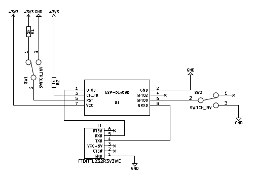

**Obsolete version, kept for reference only. Please use design.md**

# Hardware and software set up #

## Prerequisites ##

Following elements are required:

* one ESP-01 board
* one FTDI TTL-232R-3V3-WE cable
* one 3.3V power supply
* two 1k resistors
* a way to connect above elements (breadboard, etc.)
* a computer with a terminal emulator. For OS X, I use *CoolTerm*

## ESP-01 wiring ##

Seen from the chip and antenna side, the board looks like:

```
     ----------------------------
     |             -----        |
TXD  | O O  GND    |   |        |
CH_PD| O O  GPIO2  ----- []     |
RST  | O O  GPIO0  ----         |
VCC  | O O  RXD    |  |         |
     |             ----         |
     ----------------------------
```

VCC is 3.3V. RXD/TXD are 3.3V TTL.

CH_PD must be pulled to 3.3V via a resistor (1k).

RST must be pulled to 3.3V via a resistor (1k).

TXD has to be connected to the RXD wire of the FTDI cable. RXD has to
be connected to the TXD wire of the FTDI cable.

## FTDI cable wiring ##

| Pin | Color  | Use | Type   |
| --- | ------ | --- | ------ |
| 1   | black  | GND |        |
| 2   | brown  | CTS | Input  |
| 3   | red    | VCC |        |
| 4   | orange | TXD | Output |
| 5   | yellow | RXD | Input  |
| 6   | green  | RTS | Output |

VCC is at +5V. It must not be used.

## Schematic ##


## First connection ##

Connect the FTDI USB cable to a computer. Using a terminal emulator,
connect to the serial-over-USB port. Configuration:

* 9600 b/s
* 8 data bits
* no parity
* 1 stop bit
* no flow control

On OS X, I use *CoolTerm* (see reference section) for terminal emulation. Device assigned to virtual serial port is `/dev/tty.usbserial-FTGDQUKC` (last part of the name is cable unique serial number).

Send `AT+GMR` command. Reply is `0018000902-AI03` for the ESP-01 I use.

## First firmware download ##

### Overview ###

First step is to install the development environment. There are several ways to do so:

* the [Espressif way](http://bbs.espressif.com/viewtopic.php?f=67&t=821)
* the [Espressif Community way](https://github.com/esp8266/esp8266-wiki/wiki/Toolchain)
* the [open way](https://github.com/pfalcon/esp-open-sdk)

### The Espressif way ###

Espressif way refers to [files stored on Baidu](http://pan.baidu.com/s/1gd3T14n). Downloading from there can be quite slow. Files [can be found on Google Drive](https://drive.google.com/folderview?id=0B5bwBE9A5dBXaExvdDExVFNrUXM&usp=sharing) as well.

#### Virtual image installation and configuration ####

* download and install [VirtualBox](https://www.virtualbox.org/wiki/Downloads). Advised version is 4.3.12, but is not supported by the version of OS X I use. Consequently, I install version 5.0.10
* download virtual image, which contains the toolchain
* from VirtualBox, import the virtual image
* declare shared folder. For me: `~/DevTools/Espressif/sharedFolder`
* download [IoT Non-OS SDK](http://bbs.espressif.com/viewtopic.php?f=46&t=1124)
* copy IoT SDK to shared folder, and copy IoT Demo source code to the `app` folder
* start the virtual machine
* thanks to **Preferences / Keyboard Input Methods**, add support for AZERTY keyboard (for a MacBook, beware: some keys are not at the usual place, e.g. `-` or `_`)
* upgrade to Guest Additions 5.0.10:
  * click on **Devices / Insert Guest Additions CD Image...** and mount it. For me, it was mounted at ``/media/esp8266/VBOXADDITIONS_5.0.10_104061``
  * open a terminal, go into this directory, and run command

```
$ sudo ./VBoxLinuxAdditions.run
```
* reboot the virtual machine: ``sudo reboot``
* read UID and GID for *esp8266* user from ``/etc/passwd``. In my case: ``1000:1000``.
* mount shared folder:

```
$ sudo mount -o gid=1000,uid=1000 -t vboxsf share /mnt/Share
```

#### Build of IoT Demo ####

Reference document seems to be [2A-ESP8266__IOT_SDK_User_Manual__EN_v1.4.pdf](http://bbs.espressif.com/viewtopic.php?f=51&t=1024).

* go into ``app`` directory and run ``./gen_misc.sh``. Enter following parameters:
  * boot version: 1 (boot V1.2+)
  * bin: 1 (user1.bin)
  * SPI speed: to be checked. Let's keep default value for now
  * SPI mode: same
  * SPI size: to be checked. Let's choose 2 (512KB + 512KB) for now

Displayed results:

```
!!!
-152710429
152710428
Support boot_v1.2 and +
Generate user1.1024.new.2.bin successully in folder bin/upgrade.
boot.bin------------>0x00000
user1.1024.new.2.bin--->0x01000
!!!
make: warning:  Clock skew detected.  Your build may be incomplete.
```

* perform a ``make clean`` and run same process again, for ``user2.bin``

Displayed results:

```
!!!
303209664
303209665
Support boot_v1.2 and +
Generate user2.1024.new.2.bin successully in folder bin/upgrade.
boot.bin------------>0x00000
user2.1024.new.2.bin--->0x81000
!!!
make: warning:  Clock skew detected.  Your build may be incomplete.
```
#### Installation of the flash download tool ####

[This page](http://bbs.espressif.com/viewtopic.php?f=57&t=433) gives indications about a download tool with GUI. But I did not succeed in getting it to work. So, let's install the one available [here](https://github.com/themadinventor/esptool):

* go into `~/DevTools/Espressif/` and clone the repository:

```
$ git clone https://github.com/themadinventor/esptool.git
```
* the clone operation creates a subdirectory named `esptool`
* install *pyserial*:

```
$ sudo easy_install pyserial
```
#### Schematic ####

RST and GPIO0 must be wired so that they can be set to GND when required:



In normal mode, RST is connected to 3.3V, and GPIO0 is left floating (it is connected to an internal pull-up resistor).

To set ESP-01 in UART download mode:

* switch RST to GND
* switch GPI0 to GND
* switch back RST to 3.3V
* switch back GPI0 to floating

The ESP-01 is now in UART download mode.

#### Test of UART download mode ####

In directory `~/DevTools/Espressif/esptool/`, enter following command, using your cable serial number:

```
$ ./esptool.py -p /dev/tty.usbserial-FTGDQUKC read_mac
```

A message similar to this one should be displayed:

```
Connecting...
MAC: 18:fe:34:a0:33:c9
```

When requesting flash id:

```
$ ./esptool.py -p /dev/tty.usbserial-FTGDQUKC flash_id
Connecting...
Manufacturer: c8
Device: 4013
```

It seems that the `flash_id` command switches ESP-01 back to normal mode.

According to [this page](http://code.coreboot.org/p/flashrom/source/tree/HEAD/trunk/flashchips.h), flash device is a GIGADEVICE GD25Q40. According to [this page](http://www.elnec.com/en/device/GigaDevice+Semic./GD25Q40+%5BTSSOP8%5D/), this is a 4 Mbit flash device.

#### Backuping flash device contents ####

To backup the contents of the flash device, use this command:

```
./esptool.py --port /dev/tty.usbserial-FTGDQUKC read_flash 0x00000 0x80000 ./ESP01Backup.bin
```

`0x80000` is for 512KB, i.e. 4 Mb. `./ESP01Backup.bin` is the file where memory contents is to be saved.

The read operation takes about one minute.

To reprogram the ESP-01 with this image:

```
./esptool.py --port /dev/tty.usbserial-FTGDQUKC write_flash 0x00000 ESP01Backup.bin
```

The write operation takes about one minute.

### The open way ###

*[I did not succeed in fully configuring this way. Kept for reference only.]*

Steps described below are for *OS X El Capitan* (10.11.1).

#### Requirements and dependencies ####

* install *brew*:

```
$ ruby -e "$(curl -fsSL https://raw.githubusercontent.com/Homebrew/install/master/install)"
```
* install dependencies:

```
$ brew tap homebrew/dupes
$ brew install binutils coreutils automake wget gawk libtool gperf gnu-sed --with-default-names grep
$ export PATH="/usr/local/opt/gnu-sed/libexec/gnubin:$PATH"
```
* create a virtual disk with case-sensitive file system:

```
$ mkdir -p ~/DevTools/espopensdk
$ sudo hdiutil create ~/DevTools/espopensdk/case-sensitive.dmg -volname "case-sensitive" -size 10g -fs "Case-sensitive HFS+"
$ sudo hdiutil mount ~/DevTools/espopensdk/case-sensitive.dmg
$ cd /Volumes/case-sensitive
```

#### Building and configuring the SDK ####

* clone repository:

```
$ git clone --recursive https://github.com/pfalcon/esp-open-sdk.git
```
* build the project. We choose the separated (non-standalone) SDK:

```
$ cd esp-open-sdk
$ make STANDALONE=n
```
Make process stops with many error messages similar to this one:

```
/Library/Developer/CommandLineTools/usr/bin/../include/c++/v1/iterator:413:13: error: unknown type name 'ptrdiff_t'
```
A solution is given [here](https://github.com/pfalcon/esp-open-sdk/issues/45):

```
$ sed -i.bak '/__need_size_t/d' ./crosstool-NG/.build/src/gmp-5.1.3/gmp-h.in
$ make STANDALONE=n
```
Once the SDK is installed, following information is displayed:

```
Xtensa toolchain is built, to use it:

export PATH=/Volumes/case-sensitive/esp-open-sdk/xtensa-lx106-elf/bin:$PATH

Espressif ESP8266 SDK is installed. Toolchain contains only Open Source components
To link external proprietary libraries add:

xtensa-lx106-elf-gcc -I/Volumes/case-sensitive/esp-open-sdk/sdk/include -L/Volumes/case-sensitive/esp-open-sdk/sdk/lib
```
* add following lines to `~/.bash_profile`:

```
export PATH="/usr/local/opt/gnu-sed/libexec/gnubin:$PATH"
export PATH=/Volumes/case-sensitive/esp-open-sdk/xtensa-lx106-elf/bin:$PATH
```
* install *pyserial*:

```
$ sudo easy_install pyserial
```

#### Building an example ####

Did not succeed in building an example...

# Reference material #

* ESP8266
  * [Getting Started with ESP8266](http://www.esp8266.com/wiki/doku.php?id=getting-started-with-the-esp8266)
  * [Espressif documentation](http://bbs.espressif.com/viewtopic.php?f=67&t=225)
  * [ESP8266 KiCAD files](https://github.com/jdunmire/kicad-ESP8266)
* Misc.
  * [brew](http://brew.sh/)
  * [FTDI USB TTL Serial Cables](http://www.ftdichip.com/Products/Cables/USBTTLSerial.htm)
  * [CoolTerm: free terminal emulator for OS X](http://freeware.the-meiers.org/)