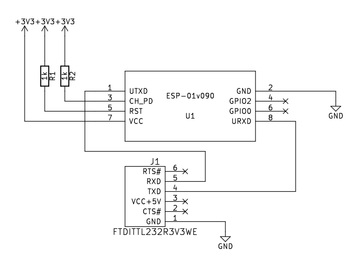
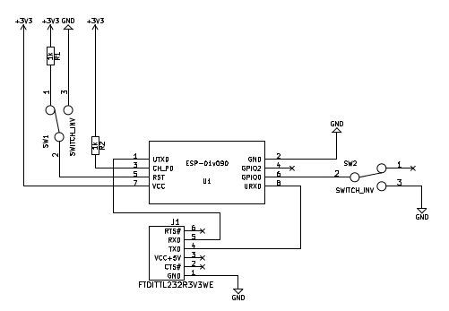

# Hardware and software set up #

**Note**: all information given herein is for a *Mac* running *OS X El Capitan* (10.11.1).

Direct access to other pages:

* [How to use Eclipse](designEclipse.md)
* [First RTOS use: SoftAP example](designSoftAP.md)
* [Non-trivial RTOS use: Intertask communication example](designInterTask.md)

## Prerequisites ##

Required elements:

* one ESP-01 board
* one FTDI TTL-232R-3V3-WE cable
* one 3.3V power supply
* two 1k resistors
* a way to connect above elements (breadboard, etc.)
* a terminal emulator. I use [*CoolTerm*](http://freeware.the-meiers.org/)

## ESP-01 wiring ##

Seen from the chip and antenna side, the board looks like:

```
     ----------------------------
     |             -----        |
TXD  | O O  GND    |   |        |
CH_PD| O O  GPIO2  ----- []     |
RST  | O O  GPIO0  ----         |
VCC  | O O  RXD    |  |         |
     |             ----         |
     ----------------------------
```

VCC is 3.3V. RXD/TXD are 3.3V TTL.

CH_PD must be pulled to 3.3V via a resistor (1k).

RST must be pulled to 3.3V via a resistor (1k).

TXD has to be connected to the RXD wire of the FTDI cable. RXD has to
be connected to the TXD wire of the FTDI cable.

## FTDI cable wiring ##

| Pin | Color  | Use | Type   |
| --- | ------ | --- | ------ |
| 1   | black  | GND |        |
| 2   | brown  | CTS | Input  |
| 3   | red    | VCC |        |
| 4   | orange | TXD | Output |
| 5   | yellow | RXD | Input  |
| 6   | green  | RTS | Output |

VCC is at +5V. It must not be used.

## Schematic ##



## First contact ##

Connect the FTDI USB cable to the Mac. Using the terminal emulator,
connect to the serial-over-USB port. Configuration:

* 9600 b/s
* 8 data bits
* no parity
* 1 stop bit
* no flow control

Device assigned to virtual serial port is `/dev/tty.usbserial-FTGDQUKC` (last part of the name is cable unique serial number. It depends on the cable.)

Send `AT+GMR` command. For the ESP-01 I use, reply is `0018000902-AI03`.

## First firmware download ##

### Various possibilities ###

First step is to install the development environment. There are several ways to do so:

* the [Espressif way](http://bbs.espressif.com/viewtopic.php?f=67&t=821)
* the [Espressif Community way](https://github.com/esp8266/esp8266-wiki/wiki/Toolchain)
* the [open way](https://github.com/pfalcon/esp-open-sdk)

For use of RTOS SDK, the open way [is recommended by Espressif](https://github.com/espressif/ESP8266_RTOS_SDK). So, I'll go with it.

### Requirements and dependencies ###

* install *brew*:

```
$ ruby -e "$(curl -fsSL https://raw.githubusercontent.com/Homebrew/install/master/install)"
```
* install dependencies:

```
$ brew tap homebrew/dupes
$ brew install binutils coreutils automake wget gawk libtool gperf gnu-sed --with-default-names grep
$ export PATH="/usr/local/opt/gnu-sed/libexec/gnubin:$PATH"
```
* create a virtual disk with case-sensitive file system:

```
$ mkdir -p ~/DevTools/espopensdk
$ sudo hdiutil create ~/DevTools/espopensdk/case-sensitive.dmg -volname "case-sensitive" -size 10g -fs "Case-sensitive HFS+"
$ sudo hdiutil mount ~/DevTools/espopensdk/case-sensitive.dmg
$ cd /Volumes/case-sensitive
```

### Building and configuring the SDK ###

* clone repository:

```
$ git clone --recursive https://github.com/pfalcon/esp-open-sdk.git
```
* build the project. I choose the separated (non-standalone) SDK:

```
$ cd esp-open-sdk
$ make STANDALONE=n
```
Make process stops with many error messages similar to this one:

```
/Library/Developer/CommandLineTools/usr/bin/../include/c++/v1/iterator:413:13: error: unknown type name 'ptrdiff_t'
```
A solution is given [here](https://github.com/pfalcon/esp-open-sdk/issues/45):

```
$ sed -i.bak '/__need_size_t/d' ./crosstool-NG/.build/src/gmp-5.1.3/gmp-h.in
$ make STANDALONE=n
```
Once the SDK is installed, following information is displayed:

```
Xtensa toolchain is built, to use it:

export PATH=/Volumes/case-sensitive/esp-open-sdk/xtensa-lx106-elf/bin:$PATH

Espressif ESP8266 SDK is installed. Toolchain contains only Open Source components
To link external proprietary libraries add:

xtensa-lx106-elf-gcc -I/Volumes/case-sensitive/esp-open-sdk/sdk/include -L/Volumes/case-sensitive/esp-open-sdk/sdk/lib
```
* add following lines to `~/.bash_profile`:

```
export PATH="/usr/local/opt/gnu-sed/libexec/gnubin:$PATH"
export PATH=/Volumes/case-sensitive/esp-open-sdk/xtensa-lx106-elf/bin:$PATH
```

### Installation of the flash download tool ###

[This page](http://bbs.espressif.com/viewtopic.php?f=57&t=433) gives indications about a download tool with GUI. But I did not succeed in getting it to work. So, let's install the one available [here](https://github.com/themadinventor/esptool):

* create `~/DevTools/Espressif/` directory, go into it, and clone the repository:

```
$ git clone https://github.com/themadinventor/esptool.git
```
* the clone operation creates a subdirectory named `esptool`
* install *pyserial*:

```
$ sudo easy_install pyserial
```
### New schematic ###

RST and GPIO0 must be wired so that they can be set to GND when required:



In normal mode, RST is connected to 3.3V, and GPIO0 is left floating (it is connected to an internal pull-up resistor).

To set ESP-01 in UART download mode:

* switch RST to GND
* switch GPI0 to GND
* switch back RST to 3.3V
* switch back GPI0 to floating

The ESP-01 is now in UART download mode.

### Test of UART download mode ###

In directory `~/DevTools/Espressif/esptool/`, enter following command, using the right cable serial number:

```
$ ./esptool.py -p /dev/tty.usbserial-FTGDQUKC read_mac
```

A message similar to this one should be displayed:

```
Connecting...
MAC: 18:fe:34:a0:33:c9
```

Request flash id:

```
$ ./esptool.py -p /dev/tty.usbserial-FTGDQUKC flash_id
Connecting...
Manufacturer: c8
Device: 4013
```

It seems that the `flash_id` command switches ESP-01 back to normal mode.

According to [this page](http://code.coreboot.org/p/flashrom/source/tree/HEAD/trunk/flashchips.h), flash device is a *GIGADEVICE GD25Q40*. According to [this page](http://www.elnec.com/en/device/GigaDevice+Semic./GD25Q40+%5BTSSOP8%5D/), this is a 4 Mbit flash device.

### Backuping flash device contents ###

To backup the contents of the flash device, run this command:

```
./esptool.py --port /dev/tty.usbserial-FTGDQUKC read_flash 0x00000 0x80000 ./ESP01Backup.bin
```

`0x80000` is for 512KB, i.e. 4 Mb. `./ESP01Backup.bin` is the file where memory contents is to be saved.

The read operation takes about one minute.

To reprogram the ESP-01 with this image:

```
./esptool.py --port /dev/tty.usbserial-FTGDQUKC write_flash 0x00000 ESP01Backup.bin
```

The write operation takes about one minute.

## First RTOS application ##

### Configuration ###

Download [RTOS SDK](http://bbs.espressif.com/viewtopic.php?f=46&t=1329&p=4419). Current version is 1.3.0, 2015-11-02:

```
$ git clone https://github.com/espressif/ESP8266_RTOS_SDK.git
```

This operation creates a directory named `ESP8266_RTOS_SDK`. Move it to `~/DevTools/Espressif/`.

### Building and programming test ###

Decide on a directory that will be used to store source code and binary files. In my case, for this first trial, I create: 

* `~/Dev/ESP-01/code/firstTrial/`
* `~/Dev/ESP-01/bin/firstTrial/`

Copy files from `~/DevTools/Espressif/ESP8266_RTOS_SDK/examples/project_template/` directory to `~/Dev/ESP-01/code/firstTrial/`. Edit `gen_misc.sh` file contents, to set `SDK_PATH` and `BIN_PATH`. For my configuration: 

```
export SDK_PATH=~/DevTools/Espressif/ESP8266_RTOS_SDK
export BIN_PATH=~/Dev/ESP-01/bin/firstTrial
```

From a terminal, go into `~/Dev/ESP-01/code/firstTrial/`. Make `gen_misc.sh` executable. Run it. Accept default answer for every question. When build ends, a message similar to this one is displayed:

```
!!!
SDK_PATH: /blablabla/DevTools/Espressif/ESP8266_RTOS_SDK
BIN_PATH: /blablabla/Dev/ESP-01/bin/firstTrial

No boot needed.
Generate eagle.flash.bin and eagle.irom0text.bin successully in BIN_PATH
eagle.flash.bin-------->0x00000
eagle.irom0text.bin---->0x40000
!!!
```

Now, program the ESP-01 with these files. **Beware**: be sure to backup original flash contents (see above) before proceeding, so that you can reset ESP-01 to its initial configuration, if needed!

```
$ cd ~/Dev/ESP-01/bin/firstTrial
$ ~/DevTools/Espressif/esptool/esptool.py --port /dev/tty.usbserial-FTGDQUKC write_flash 0x00000 eagle.flash.bin 0x40000 eagle.irom0text.bin
```

The result is not really interesting, as the application outputs some information at a non supported speed.

### First RTOS test application ###

*firstTrial* code is modified, in order to set UART speed to a value supported by the terminal emulator. To do this, file `uart.c` is used. This file is available in `driver_lib` example. Following modifications have to be done, in order to integrate this file:

* correct call to `UART_intr_handler_register()` in `uart_init_new()`, in file `uart.c`:

```
/* UART_intr_handler_register(uart0_rx_intr_handler); */
UART_intr_handler_register(uart0_rx_intr_handler, NULL);
```
* set UART speed to `115200` in `uart_init_new()`
* adapt application makefile, in order to compile and link `uart.c`
* modify `user_init()`:

```
void user_init(void)
{
    uart_init_new();

    printf("SDK version:%s\n", system_get_sdk_version());
    printf("PB version\n");
    wifi_set_opmode(STATIONAP_MODE);
}
```

Then, compile, download, run and enjoy!

[Next: How to use Eclipse](designEclipse.md)

# Reference material #

* ESP8266
  * [Getting Started with ESP8266](http://www.esp8266.com/wiki/doku.php?id=getting-started-with-the-esp8266)
  * [Espressif documentation](http://bbs.espressif.com/viewtopic.php?f=67&t=225)
  * [ESP8266 KiCAD files](https://github.com/jdunmire/kicad-ESP8266)
* Misc.
  * [brew](http://brew.sh/)
  * [FTDI USB TTL Serial Cables](http://www.ftdichip.com/Products/Cables/USBTTLSerial.htm)
  * [CoolTerm: free terminal emulator for OS X](http://freeware.the-meiers.org/)