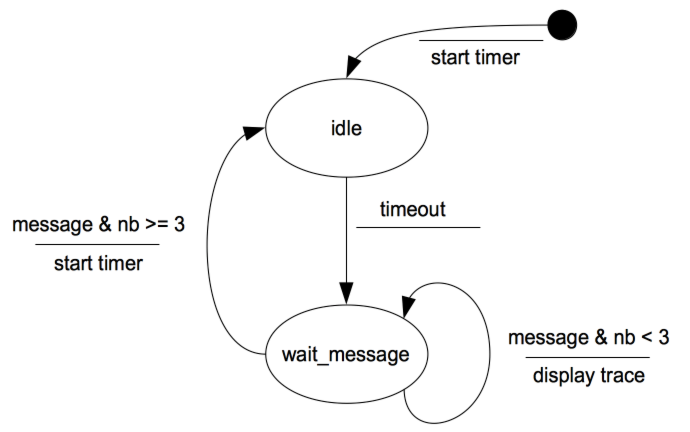

# Intertask communication #

## Introduction ##

Thanks to our previous example, we know how to configure the ESP8266 as an access point. Next step I have in mind is to write an application which connects to a Wi-Fi access point, and then opens a TCP socket to a remote host and sends it a message on a periodic basis. One way to implement this is to put all required code in one unique thread. But usually, that's better to separate functions (easier testing, easier maintenance, code reuse). In our case, this means at least one task for Wi-Fi handling and one task for TCP client handling.

But having more than one task implies intertask communication.

## Queues ##

FreeRTOS, on which Espressif RTOS SDK is based, offers the [*queue* structure](http://www.freertos.org/Embedded-RTOS-Queues.html) to implement intertask communications.

We'll use queues this way:

* every task owns a queue, used to receive messages.
* a message is made of an identifier and some (optional) data.
* a task is blocked on its queue until a new message is received. The task processes the received message, and then blocks again until next message is received.
* writing a message to a task's queue is non-blocking.
* every event that a task has to handle, including its own internal events, is delivered to the task's queue.

## Finite state automaton ##

One way to code a task is to use the finite state automaton pattern. In a few words:

* the task can be in different states. Number of such states is finite.
* at one given time, the task is in one and only one state.
* the only way to make the task transitioning from one state to another one is to send it an event. Events are serialized: at one given time, only one event is received.
* the new state depends on previous state and received event.

Refer to [this article](http://www.monblocnotes.com/node/1906), for more information about this *cooperating components* pattern.

## Example ##

### Global view ###

Our *interTask* code sample implements two tasks. 

The first one is so simple that it does not implement a finite state automaton. It uses a timer to generate a message (*counted message*) on a periodic basis.

The second task receives messages generated by the first one. At starting time, it is in an idle state, and starts a timer. When this timer expires, it enters a new state, waiting for messages sent by first task. If it receives messages from first task while in idle state, it ignores them.

After having received 3 messages from the first task, it enters back its idle state.

### Second task ###

Following diagram depicts the automaton that the second task implements:

Every state is drawn as an oval, the name of the state written inside. Arrows shows different ways to go from one state to the other one. 

On the side of every arrow, there is an horizontal line. The task can transition from one state to the other one only if the condition written above the line of related arrow is verified. Usually, this condition depends on the receipt of an event.

When transitioning from one state to the other one, the task performs the action(s) written below the line.

The task starts from the small black disk.

### RTOS services ###

To implement the behaviour presented above, the code calls on following RTOS services:

* [queues](http://www.freertos.org/a00018.html)
* [timers](http://www.freertos.org/FreeRTOS-Software-Timer-API-Functions.html)
* [tasks](http://www.freertos.org/a00019.html)

Our code, starting with this example, follows [FreeRTOS naming conventions](http://www.freertos.org/FreeRTOS-Coding-Standard-and-Style-Guide.html#NamingConventions).

[Next: TCP client](designTCPClient.md)

[Home](design.md)