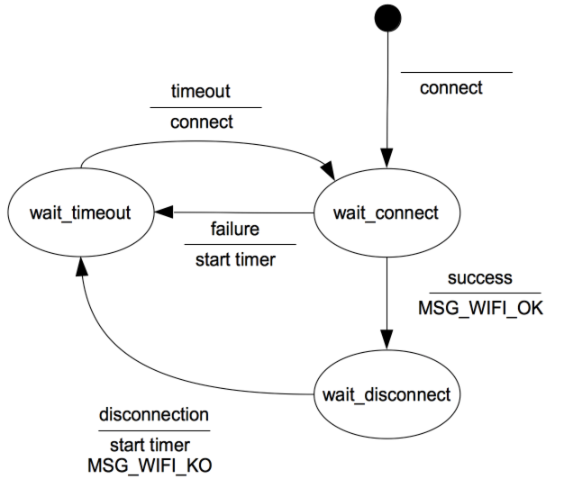
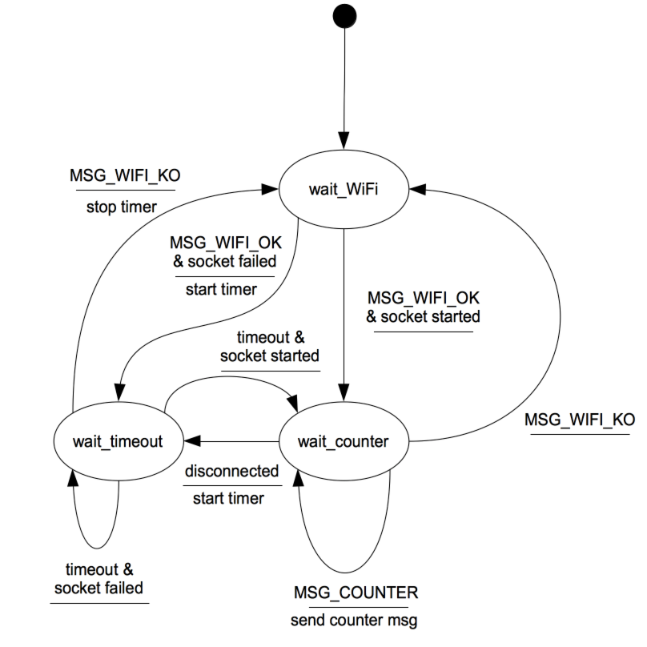

# TCP client #

## Functional specifications ##

In this example, we configure the ESP8266 as a station. It is configured to connect to a Wi-Fi access point known as being available.

Once connected, the application tries to create a TCP socket to given remote host and port.

If the socket creation fails, it waits for some time and then retries.

If the creation succeeds, it sends a short message to the remote host, on a periodic basis. In our example, message contents is a counter from 0 to 255, incremented before each message transmission. When it reaches 255, it is reset to 0.

If the TCP connectivity is lost, the application waits for some time and then retries.

If Wi-Fi connectivity is lost, same behaviour: wait and then retry.

## Simple binary protocol ##

### Message framing ###

Messages transmitted by the application are exchanged over a TCP socket. TCP is a byte-stream protocol: it only guarantees that a byte sequence sent from one side will be received on the other side, with bytes in the same order, without loss or error. So, if we want to send messages, we need to add a message-framing layer.

In this example, we use following framing mechanism:

* a frame starts with two bytes containing the number of data bytes to be transmitted. Data bytes then follow these two bytes.
* first byte contains the LSB (least significant byte) of the number of bytes. Second byte contains the MSB (most significant byte).
* data bytes can contain any type of data.

### Message types ###

Our application uses only one message, the **counter** message. So we could simply send the counter as one byte. What's more, as we send only one byte, we don't need the above framing mechanism. But that's better to design our code so that it can easily support future evolutions, e.g. several types of messages, and messages containing more than one byte.

So, we define a simple message structure. A first byte contains message type, while following bytes contains data specific to message type. For our **counter** message:

```
---------------
| 1 | counter |
---------------
  1      1     
Counter message
```

We decide that *message type* for **counter** message is **1**. As we said above, it is coded in one byte. And the counter itself is stored in another byte.

Consequently, the whole frame that will be sent to the remote host is:

```
------------------------
| length | 1 | counter |
------------------------
    2      1      1     
```

In our case, **length** value is 2. So resulting frame is:

```
------------------------
| 2 | 0 | 1 | counter |
------------------------
```
(remember that length LSB is transmitted first).

### Message protocol ###

Our example is very simple. So we don't need any specific protocol. We simply send a **counter** message on a periodic basis. For real-world applications, it's usually required to define and use some application-level protocol, in order to guarantee that the whole system state stays consistent, even when some message exchanges are disrupted by connectivity losses.

### Existing protocols? ###

You could ask: "Why do you define your own framing and protocol while JSON over HTTP, MQTT, and CoAP exist?"

Well, my answer is simply: "In this example, we use TCP as a transport layer, and we handle only one type of message. JSON over HTTP is far too verbose, while MQTT and CoAP are far too sophisticated. Let's use the right tool for the job!"

## Design specifications ##

The application is made of following tasks:

* **Wi-Fi station** task
* **TCP client** task
* **counter** task

The **Wi-Fi station** task tries to connect to the access point. When it succeeds, it sends an `MSG_WIFI_OK` message to the **TCP client** task. When Wi-Fi connectivity is lost, an `MSG_WIFI_KO` message is sent to the **TCP client** task.

When Wi-Fi connectivity is not available, or disappears, we do not try to reconnect immediately. We first wait for a predefined delay. Why do this, while we could let the ESP8266 try reconnecting (it does it automatically)? Because we wanted our code to be ready to support low-power requirements: during wait periods between two reconnection attempts, we could switch the ESP8266 to a sleep mode.

Task automaton is below:


The **TCP client** task waits for an `MSG_WIFI_OK` message. When received, it tries to connect to the remote host. Once done, it accepts `MSG_COUNTER` messages generated by the **counter** task, and sends resulting **counter** message to the remote host. When TCP connectivity is lost, it tries to reconnect after having waited for some time. When `MSG_WIFI_KO` is received, the task closes the soket, and waits for `MSG_WIFI_OK` message.

Task automaton is below:


The **counter** task increments a counter every 10 seconds, and sends resulting value to the **TCP client** task, in an `MSG_COUNTER` message.

There is no buffering, in this simple example. While Wi-Fi connectivity is not available, or while TCP socket is not open, counter information is lost.

### A few words about code ###

We do not use any dynamic memory allocation (e.g. *malloc*), as this can lead to memory leak, memory fragmentation, and non-deterministic response time (this later point not being of real importance in our case).

In order to reduce stack needs for tasks, most variables are declared as global ones.

[Home](design.md)